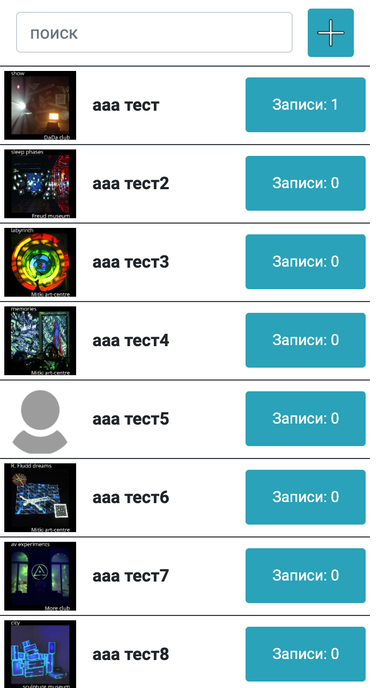

# asp.net core + react web braid studio clients database

База данных клиентов брейд студии braidcode. Задача приложения - из нескольких аккаунтов мастеров добавлять/редактировать/удалять новых клиентов с фото, добавлять каждому клиенту записи с описанием и фото работы с помощью мобильного телефона или ноутбука. Преимущественно используется на мобильном ( оформление десктопной части не доработано). База данных - MySql, регистрация - JwtBearer, серверная часть - asp.net core, клиентская - react. 

Страница регистрации мастера:

Главная страница со списком клиентов и кнопкой добавления нового клиента:

Главная страница с выбранным клиентом и полем с кнопками управления клиентом (кнокпи добавления новой записи колиенту, редактирования клиента и удаления клиента):

Форма добавления нового клиента с полями - фото, имя, телефон (для поля ввода и валидации номера телефона используется react-phone-number-input):

Валидация формы добавления нового клиента (поле "имя" является обязательным):

Форма редактирования клиента (для редактирования и удаления используется одна и та же форма):

Диалог удаления клиента:

Страница со списком записей конкретного клиента:

Страница со списком записей конкретного клиента с выбранной записью и открывшемся полем с кнопками управления записью:

Форма добавления новой записи клиенту с полями - фото, дата, вид работы, стоимость работы, детали работы, комментарий:

Валидация формы добавления новой записи клиенту (поля "вид работы" и "стоимость" являются обязательными):

Форма редактирования записи клиента (для редактирования и удаления используется одна и та же форма):

Диалог удаления записи клиента:

Окно загрузки (приложение часто используется в зоне нестабильного инетернет соединения). Для отображения спиннера загрузки используется react-promise-tracker:

